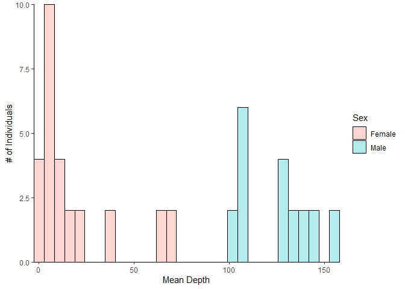
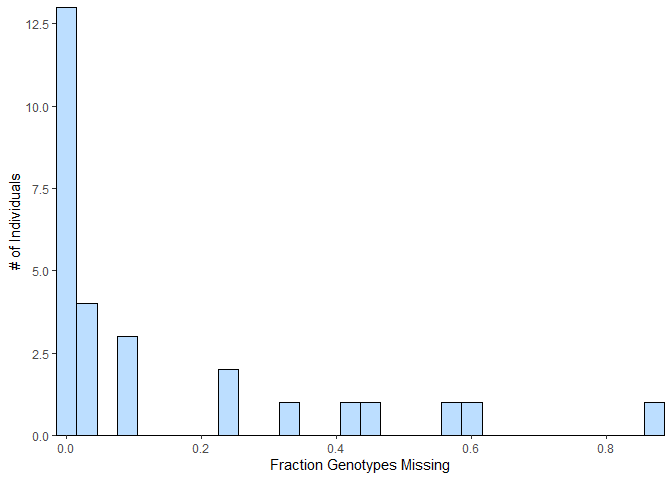
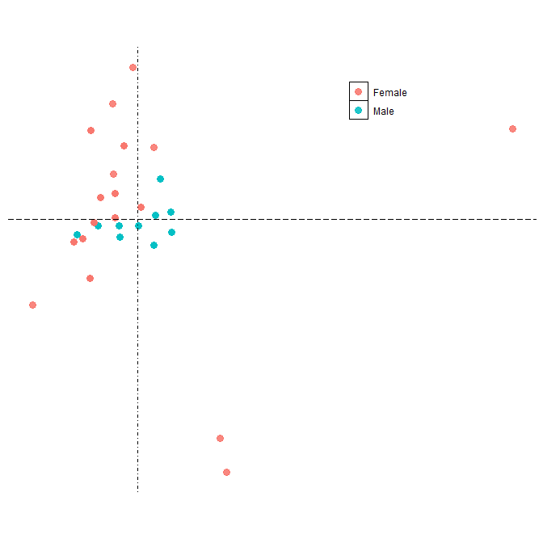

# Spurp_SexDetermination_RAD
Bioinformatic WorkFlow used to find sex specific genotypes within Spurp using RAD seq
10 M, 18 F

## Process Reads

```shell
#!/usr/bin/env bash

INDIR=/home/Shared_Data/Spurp_RAD/raw_reads_3
OUTDIR=/home/Shared_Data/Spurp_RAD/01-PROCESS
for i in ls $INDIR/*_1.fq.gz;
do
        fq1=${i}
        fq2=$(echo ${i} | sed 's/_1./_2./')

        FQ1=$(echo ${fq1} | sed -e 's/_1./.out_1./' -e 's+raw_reads_3+01-PROCESS+')
        FQ2=$(echo ${fq2} | sed -e 's/_2./.out_2./' -e 's+raw_reads_3+01-PROCESS+')

        OUTPUT=$(basename $fq1 _1.fq.gz)

        /usr/local/bin/fastp -i $fq1 -I $fq2 -o $FQ1 -O $FQ2 --correction -h ${OUTDIR}/$OUTPUT.html &> ${OUTDIR}/$OUTPUT.log


done
```

## Alignment

Reference Genome: http://ftp.echinobase.org/pub/Genomics/Spur5.0/sp5_0_GCF_genomic.fa.gz


```shell
#!/usr/bin/env bash
PROG=/usr/local/bin
####################
# Reference Genome #
#     1. Index     #
#     2. align     #
####################

# Reference Directory and fasta
REFDIR=/home/Shared_Data/Spurp_RAD/ref_genome
REF=sp5_0_GCF_genomic.fa

# Write Index Spurp from reference

/usr/local/bin/bwa index -a bwtsw -p ${REFDIR}/Spurp ${REFDIR}/${REF}

INDIR=/home/Shared_Data/Spurp_RAD/01-PROCESS
OUTDIR=/home/Shared_Data/Spurp_RAD/02-ALIGN
rm $OUTDIR/bam_stats.txt

for i in ${INDIR}/*1.fq.gz;
do
        # RAD Paired Files
        FQ1=${i}
        FQ2=$(echo $FQ1 | sed 's/1.fq.gz/2.fq.gz/')
        # Prefix (ID)
        SAM=$(basename $FQ1 .out_1.fq.gz)
        BAM=$OUTDIR/${SAM}.bam
        #echo $FQ1 $FQ2 $SAM
	
	# Align Reads
        $PROG/bwa mem -t 20 -R $RG ${REFDIR}/Spurp $FQ1 $FQ2 | \
        $PROG/samtools view -S -h -u - | \
        $PROG/samtools sort - > $BAM
        $PROG/samtools index $BAM

        # Get Alignment Statistics
        MM=$($PROG/samtools flagstat $BAM | grep -E 'mapped \(|properly' | cut -f1 -d '+' | tr -d '\n')
        CM=$($PROG/samtools idxstats $BAM | mawk '$3 > 0' | wc -l)
        CC=$($PROG/samtools idxstats $BAM | mawk '{ sum += $3; n++ } END { if (n > 0) print sum / n; }')
        DD=$($PROG/samtools idxstats $BAM | mawk '$3 >0' | mawk '{ sum += $3; n++ } END { if (n > 0) print sum / n; }')
        BM=$($PROG/samtools flagstat $BAM | grep mapQ | cut -f1 -d ' ')
        MR=$($PROG/samtools flagstat $BAM |  grep "mapped (" | awk '{print $5}' | cut -b 2-5)
        echo -e "$SAM\t$MM\t$CM\t$CC\t$DD\t$BM\t$MR" >> $OUTDIR/bam_stats.txt

done
```

**Alignment Statistics** are stored **here**: /02-ALIGN/bam_stats.txt 

## Variant Calling

error message from /usr/local/bin/freebayes : 
/usr/local/bin/freebayes: error while loading shared libraries: libbz2.so.1.0: cannot open shared object file: No such file or directory

Switched to locally installing via anaconda ``conda install -c bioconda freebayes/1.3.5``

```shell
#!/usr/bin/env bash
PROG=/usr/local/bin
DIR=/home/Shared_Data/Spurp_RAD/03-VARIANT

######### Attach filter prefix ---------------------------------------

FILE=${DIR}/Spurp.vcf
F1=$(echo $FILE | sed 's/vcf/minQ20.minGQ20.minDP40.maxDP166.vcf/')
F2=$(echo $F1 | sed 's/vcf/miss1.vcf/')
F3=$(echo $F2 | sed 's/vcf/snps.vcf/')
F4=$(echo $F3 | sed 's/vcf/ri.vcf/')

########### vcftools  -----------------------------------------------

$PROG/vcftools --vcf $FILE --minQ 20 --minGQ 20 --min-meanDP 40 --max-meanDP 166 --recode --recode-INFO-all --stdout > $F1

########## per-pop miss --------------------------------------------

# write popmap.txt
awk '{print $4"\t"$3}' /home/Shared_Data/Spurp_RAD/meta/Sp_Radseq_Files_Guide.txt | tail -n +2 | sort | uniq > popmap.txt

sh filter_miss_by_pop.sh $F1 popmap.txt .99 1 $F2

########## DECOMPOSE into SNPs ------------------------------------

$PROG/vcfallelicprimitives $F2 --keep-info --keep-geno > $F3

######### Remove INDELS -------------------------------------------

$PROG/vcftools --vcf $F3 --remove-indels --recode --recode-INFO-all --stdout > $F4
```

<p align="center">


</p>

**Figure 1.** Distribution of data for individual missingness and mean-depth

<p align="center">

</p>


**Figure 2.** principal component analysis via plink ~6% variance explained on both axis

## Presence & Absence w/ Sex

## Bedtools 
``bedtools coverage``

## Mapping

map short reads to a genome with assigned chromosomes.
