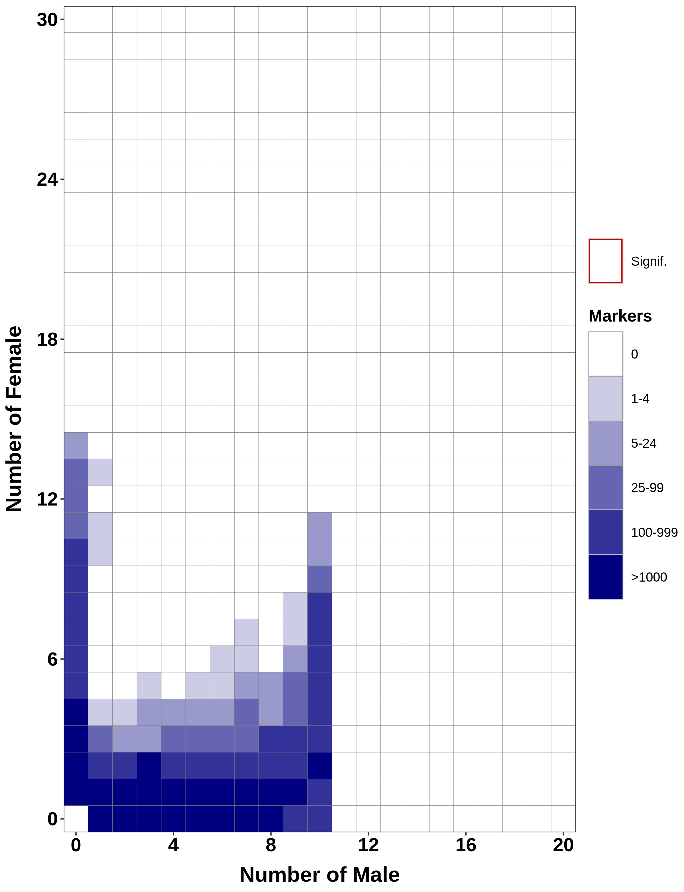
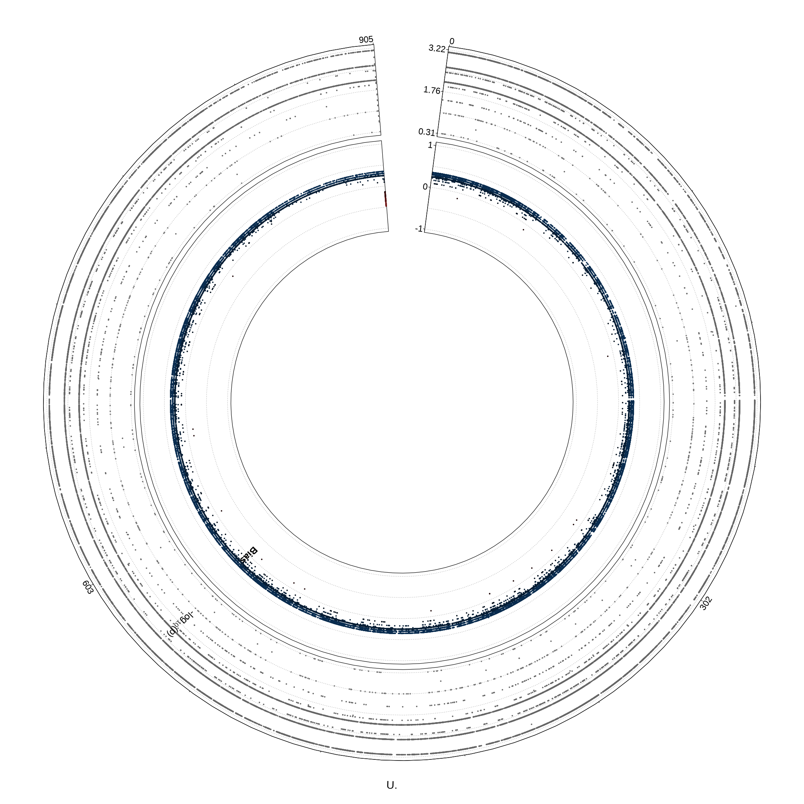

# Spurp_SexDetermination_RAD
Bioinformatic WorkFlow used to find sex specific genotypes within Spurp using RAD seq

Purple Sea Urchin: 10 M, 18 F

Extracted ID's from meta data file. 

## Process Reads

Reads were processed using fastp and found to already have had been trimmed for barcodes.

## Alignment

Spur_5.0 scaffold assembly: GCA_000002235.4 
	Mapping Rate ~98%
Lvar_3.0 chromosomal assembly: GCA_018143015.1 
	Mapping Rate ~8%

## Variant Calling

Switched to locally installing via anaconda ``conda install -c bioconda freebayes/1.3.5``

Succesfully genotyped ~30,000 sites

## Variant Filtering

Sites were removed based on genotype quality, mapping quality, and missingness within Sex group (Male, Female).

Differences in sequencing depth makes thresholds hard to determine, min/maxDP filters produces high levels of missingness in Female samples.

**Figure 1.** Distribution of data for individual missingness and mean-depth from Spurp.minQ20.minGQ20.mac3.miss1.snps.ri.vcf (~7,000 SNPs)

**Figure 2.** principal component analysis via plink ~6% variance explained on both axis (PC1 vs. PC2) (~2103 SNPs)

## Presence/Absence

Performed a logistical regression on individual genotypes using Sambada

## Case/Control

''plink --assoc fisher'' using sex as the encoded phenotype.

## radsex

**Figure 3.** heatmap showing association (presence/absence) of marker (read based on minimum depth threshold). R 
circlize package showing significant levels in sex bias on the top track and association on the bottom track. 

> #### Fine Tuning
> - distrib --min-depth <threshold>
> - extract a subset and cluster markers based on depth -> radsex_markers_depth() *subset* command
> - mapping quality threshold  

## de-novo
